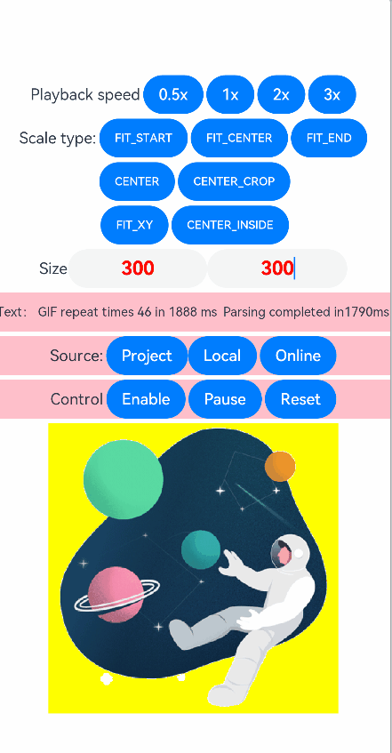

# ohos-gif-drawable

## Introduction

ohos-gif-drawable is a GIF rendering library of OpenHarmony. By drawing on the canvas, it allows you to:

- Play GIF images.
- Control the GIF playback.
- Reset the GIF animation.
- Set the GIF playback speed.
- Set callbacks to listen for GIF frame display changes.
- Set the display size.
- Choose a scale type from the list of seven options.
- Set the background color for the display area.
- Supports both hard and soft decoding modes



## How to Install

```typescript
ohpm install @ohos/gif-drawable
```
For details about the OpenHarmony ohpm environment configuration, see [OpenHarmony HAR](https://gitcode.com/openharmony-tpc/docs/blob/master/OpenHarmony_har_usage.en.md).

## How to Use

1. **The hard decoding mode is recommended, which has better performance than the soft decoding mode**

2. Use the **GIFComponent** or **GIFComponentV2** custom component at the location where the display is required.
```typescript
import { GIFComponent, ResourceLoader } from '@ohos/gif-drawable'
// Set the user attributes of the GIF drawing component.
@State model:GIFComponent.ControllerOptions = new GIFComponent.ControllerOptions();
// Specify whether to enable auto play.
@State gifAutoPlay:boolean = true;
// Specify whether to enable the reset feature for GIF playback. The setting takes effect each time the GIF playback is reversed.
@State gifReset:boolean = true;

// Add this component to other container components of ArkUI. To bind the GIF playback state with the visibility inside the scrolling component, add the bindScroller field.
GIFComponent({model:$model, autoPlay:$gifAutoPlay, resetGif: $gifReset})
```

```typescript
import { GIFComponentV2, ResourceLoader } from '@ohos/gif-drawable'
// Set the user attributes of the GIF drawing component.
@Local model:GIFComponentV2.ControllerOptions = new GIFComponentV2.ControllerOptions();
// Specify whether to enable auto play.
@Local gifAutoPlay:boolean = true;
// Specify whether to enable the reset feature for GIF playback. The setting takes effect each time the GIF playback is reversed.
@Local gifReset:boolean = true;

// Add this component to other container components of ArkUI. To bind the GIF playback state with the visibility inside the scrolling component, add the bindScroller field.
GIFComponentV2({model:this.model!!, autoPlay:this.gifAutoPlay!!, resetGif: this.gifReset!!})
```

3. Configure **GIFComponent.ControllerOptions** to achieve more effects.

```typescript
// Destroy the previous resource.
this.model.destroy();
// Create a modelx instance for configuring user parameters.
let modelx = new GIFComponentV2.ControllerOptions()
modelx
  // Configure the callback for animation end and time consumption.
  .setLoopFinish((loopTime) => {
   this.gifLoopCount++;
   this.loopHint = 'GIF repeat times: ' + this.gifLoopCount + ' in ' + loopTime + ' ms'
   })
    // Set the decoding mode of the GIF image to hard decoding
  .setOpenHardware(false)
  // Set the scale type of the image and component.
  .setScaleType(this.scaleType)
  // Set the playback speed.
  .setSpeedFactor(this.speedFactor)
// Load the online image. this in getContext(this) points to a page or component.
ResourceLoader.downloadDataWithContext(getContext(this), {
   url: 'https://pic.ibaotu.com/gif/18/17/16/51u888piCtqj.gif!fwpaa70/fw/700'
   }, (sucBuffer) => {
    // Processing after the online resource sucBuffer is returned
   modelx.loadBuffer(sucBuffer, () => {
   
   console.log ('Online image successfully parsed and drawn.')
    // Enable auto play.  
   this.gifAutoPlay = true;
    // Assign new settings to the component to achieve subsequent GIF animation effects.  
   this.model = modelx;
   })
}, (err) => {
   // Process the service based on the returned error information, for example, display a placeholder image, load the image again, or load another image.
})
```
Note: Due to screen density ity, GIF animations may not cover all edge pixels after being translated or scaled, causing a border effect during pixel blending. This issue is also seen in web and software decoding. 
## Available APIs

### GIFComponent: Custom Component

| API                                                      | Parameter                                                        | Description               |
| ------------------------------------------------------------ | ------------------------------------------------------------ | ----------------------- |
| GIFComponent({ model: GIFComponent.ControllerOptions, autoPlay: boolean,resetGif:boolean}) | model:GIFComponent.ControllerOptions, autoPlay:boolean,resetGif:boolean | Constructor for the custom GIF rendering component |

### GIFComponent.ControllerOptions: Custom Component Configuration

| API                                                    | Parameter                                            | Description                        |
| ------------------------------------------------------------ | ------------------------------------------------ | -------------------------------- |
| getFrames()                                                  |                                                  | Obtains all parsed image data frames.          |
| setOpenHardware()                                            | open: boolean                                    | Set whether to enable hard decoding        |
| setFrames(images?: GIFFrame[])                               | images?: GIFFrame[]                              | Sets the set of parsed image data frames.          |
| getLoopFinish()                                              |                                                  | Obtains the callback for the last frame of the loop.  |
| setLoopFinish(fn:(loopTime?)=>void)                          | fn:(loopTime?)=>void                             | Sets the callback for the last frame of the loop.  |
| getScaleType()                                               |                                                  | Obtains the component scale type set by the user.        |
| setScaleType(scaletype: ScaleType)                           | scaletype: ScaleType                             | Sets the component scale type.                |
| getPositionFinish()                                          |                                                  | Obtains the frame callback.                  |
| setPositionFinish(position: number, fn: (posTime?) => void)  | position: number, fn: (posTime?) => void         | Sets the frame position and callback.            |
| getSpeedFactor()                                             |                                                  | Obtains the current playback speed.                |
| setSpeedFactor(speed: number)                                | speed: number                                    | Sets the playback speed.                    |
| getSeekTo()                                                  |                                                  | Obtains a static frame that is being played.          |
| setSeekTo(gifPosition: number)                               | gifPosition: number                              | Seeks the GIF to a static frame.           |
| loadBuffer(buffer: ArrayBuffer, readyRender: (err?) => void) | buffer: ArrayBuffer, readyRender: (err?) => void | Loads an array buffer to display the GIF.|

### GIFComponent.ScaleType

| Scale Type               | Description                                                |
| ----------------------- | ------------------------------------------------------------ |
| ScaleType.FIT_START     | The content is scaled to such an extent that it can be fully displayed, and then placed in the upper left corner of the custom component.  |
| ScaleType.FIT_END       | The content is scaled to such an extent that it can be fully displayed, and then placed in the lower right corner of the custom component.  |
| ScaleType.FIT_CENTER    | The content is scaled to such an extent that it can be fully displayed, and then placed in the center of the custom component.|
| ScaleType.CENTER        | The content is placed in the center of the custom component, without having been scaled.              |
| ScaleType.CENTER_CROP   | The content is scaled to fit the custom component based on the aspect ratio of the content or custom component, whichever is smaller, and then placed in the center of the custom component.|
| ScaleType.FIT_XY        | The content width and height is scaled to fit the custom component.                 |
| ScaleType.CENTER_INSIDE | This option is equivalent to **ScaleType.FIT_CENTER** if the content width or height is greater than the width or height of the custom component and is equivalent to **ScaleType.CENTER** otherwise.|

### GIFFrame: Data Format of the Parsing Frame

```typescript
export class GIFFrame {

    // Frame width, height, top margin, and left margin.
    dims: { width: number; height: number; top: number; left: number}

    // Color array to which the pixel data of the current frame points.
    colorTable?: [number, number, number][]

    // Interval between the current frame and the next frame.
    delay: number

    // Current frame drawing requirements. 0: Retain the current frame as is. 1: Draw the current frame on top of the previous frame. 2: Restore the canvas background. 3: Restore the canvas to its state prior to drawing the current image.
    disposalType: number

    // Uint8CampedArray: patch information after color conversion, which is used for drawing.
    patch: Uint8ClampedArray
    
    // Pixel map image generated by patch.
    drawPixelMap

    // Index for searching the color table of each pixel in the current frame.
    pixels?: number[]

    // Optional color index representing transparency.
    transparentIndex: number
}
```
## About obfuscation
- Code obfuscation, please see[Code Obfuscation](https://docs.openharmony.cn/pages/v5.0/zh-cn/application-dev/arkts-utils/source-obfuscation.md)
- If you want the gif-drawable library not to be obfuscated during code obfuscation, you need to add corresponding exclusion rules in the obfuscation rule configuration file obfuscation-rules.txt：
```
-keep
./oh_modules/@ohos/gif-drawable
```

## Constraints
This project has been verified in the following version:

- DevEco Studio: NEXT Beta1-5.0.3.806, SDK: API 12 Release (5.0.0.66)
- DevEco Studio NEXT Developer Beta3: 5.0 (5.0.3.530), SDK: API 12 (5.0.0.35 (SP3))

## Directory Structure

```
|---- ohos-gif-drawable
|     |---- entry                                   # Sample code folder
			|----pages                              # Page test code
				|----index.ets                      # Test file list
				|----sample1TestCasePage.ets 		# GIF demo with hardware decoding
				|----sample2TestCasePage.ets 		# GIF demo with software decoding
				|----networkLoadTestCasePage.ets    # Online test file with software decoding
				|----loadResourceAndRawFilePage.ets # Project test file with software decoding
				|----loadStringAndBufferPage.ets	# Application test file with software decoding
|     |---- screenshots                             # Screenshots
|     |---- library                                 # ohos-gif-drawable library
|           |---- src                               # ohos-gif-drawable core code for GIF parsing and rendering
				|---- display                       # Component display and rendering
				|---- parse                         # GIF parsing
				|---- utils                         # Utility methods
|           |---- index.ets                         # Exposed APIs
|     |---- README.md                               # Readme
|     |---- README_zh.md                            # Readme
```

## How to Contribute

If you find any problem during the use, submit an [Issue](https://gitcode.com/openharmony-sig/ohos_gif-drawable/issues) or a [PR](https://gitcode.com/openharmony-sig/ohos_gif-drawable/pulls) to us.

## License

This project is licensed under [Apache License 2.0](https://gitcode.com/openharmony-sig/ohos_gif-drawable/blob/master/LICENSE).
