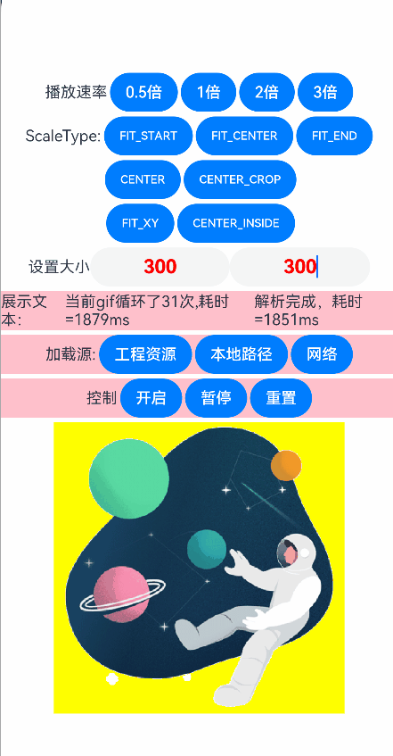

# ohos-gif-drawable

## 简介

本项目是OpenHarmony系统的一款GIF图像渲染库，基于Canvas进行绘制，主要能力如下:

- 支持播放GIF图片。
- 支持控制GIF播放/暂停。
- 支持重置GIF播放动画。
- 支持调节GIF播放速率。
- 支持监听GIF所有帧显示完成后的回调。
- 支持设置显示大小。
- 支持7种不同的展示类型。
- 支持设置显示区域背景颜色。
- 支持硬解码/软解码两种解码方式



## 下载安装

```typescript
ohpm install @ohos/gif-drawable
```
对于OpenHarmony ohpm环境配置的详细信息，请参阅[OpenHarmony环境配置指南](https://gitcode.com/openharmony-tpc/docs/blob/master/OpenHarmony_har_usage.md)。

## 使用说明

1. **建议优先使用硬解码方式,性能更优于软解码**
2. 在需要展示的位置使用GIFComponent/GIFComponentV2自定义组件
```typescript
import { GIFComponent, ResourceLoader } from '@ohos/gif-drawable'
// gif绘制组件用户属性设置
@State model:GIFComponent.ControllerOptions = new GIFComponent.ControllerOptions();
// 是否自动播放
@State gifAutoPlay:boolean = true;
// 重置GIF播放，每次取反都能生效
@State gifReset:boolean = true;

// 在ARKUI的其它容器组件中添加该组件 如果需要绑定滚动组件内部可见/不可见状态 gif自动暂停开始播放能力,只需要加上bindScroller字段即可。
GIFComponent({model:$model, autoPlay:$gifAutoPlay, resetGif: $gifReset})
```

```typescript
import { GIFComponentV2, ResourceLoader } from '@ohos/gif-drawable'
// gif绘制组件用户属性设置
@Local model:GIFComponentV2.ControllerOptions = new GIFComponentV2.ControllerOptions();
// 是否自动播放
@Local gifAutoPlay:boolean = true;
// 重置GIF播放，每次取反都能生效
@Local gifReset:boolean = true;

// 在ARKUI的其它容器组件中添加该组件 如果需要绑定滚动组件内部可见/不可见状态 gif自动暂停开始播放能力,只需要加上bindScroller字段即可。
GIFComponentV2({model:this.model!!, autoPlay:this.gifAutoPlay!!, resetGif: this.gifReset!!})
```

3. 配置 GIFComponent.ControllerOptions达到更多的效果

```typescript
// 销毁上一次资源
this.model.destroy();
// 新创建一个modelx，用于配置用户参数
let modelx = new GIFComponentV2.ControllerOptions()
modelx
  // 配置回调动画结束监听，和耗时监听	
  .setLoopFinish((loopTime) => {
   this.gifLoopCount++;
   this.loopHint = '当前gif循环了' + this.gifLoopCount + '次,耗时=' + loopTime + 'ms'
   })
  // 设置GIF图的解码方式为硬解码
  .setOpenHardware(false)
  // 设置图像和组件的适配类型
  .setScaleType(this.scaleType)
  // 设置播放速率
  .setSpeedFactor(this.speedFactor)
// 加载网络图片,getContext(this)中的this指向page页面或者组件都可以
ResourceLoader.downloadDataWithContext(getContext(this), {
   url: 'https://pic.ibaotu.com/gif/18/17/16/51u888piCtqj.gif!fwpaa70/fw/700'
   }, (sucBuffer) => {
    // 网络资源sucBuffer返回后处理
   modelx.loadBuffer(sucBuffer, () => {
   
   console.log('网络加载解析成功回调绘制！')
    // 开启自动播放   
   this.gifAutoPlay = true;
    // 给组件数据赋新的用户配置参数，达到后续gif动画效果   
   this.model = modelx;
   })
}, (err) => {
   // 用户根据返回的错误信息，进行业务处理(展示一张失败占位图、再次加载一次、加载其它图片等)
})
```
备注：由于屏幕密度关系，gif图片平移缩放后，不能沾满边缘的整个物理像素，在做像素混合效果时，会有在边缘像素形成边框效果，在web场景和源库软解码也存在相同效果
## 接口说明

### GIFComponent 自定义组件

| 方法名                                                       | 入参                                                         | 接口描述                |
| ------------------------------------------------------------ | ------------------------------------------------------------ | ----------------------- |
| GIFComponent({ model: GIFComponent.ControllerOptions, autoPlay: boolean,resetGif:boolean}) | model:GIFComponent.ControllerOptions, autoPlay:boolean,resetGif:boolean | 自定义GIF渲染组件构造器 |

### GIFComponent.ControllerOptions自定义组件配置

| 使用方法                                                     | 入参                                               | 接口描述                    |
| ------------------------------------------------------------ |--------------------------------------------------|-------------------------|
| getFrames()                                                  |                                                  | 获取所有解析图像数据帧             |
| setOpenHardware()                                            | open: boolean                                    | 设置是否开启硬解码        |
| setFrames(images?: GIFFrame[])                               | images?: GIFFrame[]                              | 设置解析图像数据帧集合             |
| getLoopFinish()                                              |                                                  | 获取循环结束最后一帧的回调方法         |
| setLoopFinish(fn:(loopTime?)=>void)                          | fn:(loopTime?)=>void                             | 设置循环结束最后一帧的回调方法         |
| getScaleType()                                               |                                                  | 获取用户设置组件展示类型            |
| setScaleType(scaletype: ScaleType)                           | scaletype: ScaleType                             | 设置组件展示类型                |
| getPositionFinish()                                          |                                                  | 获取帧回调方法                 |
| setPositionFinish(position: number, fn: (posTime?) => void)  | position: number, fn: (posTime?) => void         | 设置帧位置和回调方法              |
| getSpeedFactor()                                             |                                                  | 获取当前播放速率                |
| setSpeedFactor(speed: number)                                | speed: number                                    | 设置播放速率                  |
| getSeekTo()                                                  |                                                  | 获取当前播放某一静态帧             |
| setSeekTo(gifPosition: number)                               | gifPosition: number                              | 设置显示GIF某一静态帧            |
| loadBuffer(buffer: ArrayBuffer, readyRender: (err?) => void) | buffer: ArrayBuffer, readyRender: (err?) => void | 加载一个arraybuffer数据，展示GIF |

### GIFComponent.ScaleType

| 展示类型                | 展示类型描述                                                 |
| ----------------------- | ------------------------------------------------------------ |
| ScaleType.FIT_START     | 显示内容缩放至能全部显示，然后将其放置于自定义组件的左上方   |
| ScaleType.FIT_END       | 显示内容缩放至能全部显示，然后将其放置于自定义组件的右下方   |
| ScaleType.FIT_CENTER    | 显示内容缩放至能全部显示，然后将其放置于自定义组件的居中位置 |
| ScaleType.CENTER        | 不进行缩放，然后将其放置于自定义组件的居中位置               |
| ScaleType.CENTER_CROP   | 取（内容/自定义组件）的宽高比值的小值进行缩放，缩放至自定义组件大小，然后将其放置于自定义组件的居中位置 |
| ScaleType.FIT_XY        | 将内容宽度和高度拉伸/压缩至自定义组件的大小                  |
| ScaleType.CENTER_INSIDE | 当内容宽高任意一个大于自定义组件宽高表现为ScaleType.FIT_CENTER，如果内容都小于自定义组件表现为ScaleType.CENTER |

### GIFFrame 解析帧数据格式

```typescript
export class GIFFrame {

    // 显示帧 width 宽  height 高 top上边距 left左边距
    dims: { width: number; height: number; top: number; left: number}

    // 当前帧的像素数据指向的颜色数组
    colorTable?: [number, number, number][]

    // 当前帧到下一帧的间隔时长
    delay: number

    // 当前帧绘制要求 0保留 1在上一帧绘制此帧 2恢复画布背景 3.将画布恢复到绘制当前图像之前的先前状态
    disposalType: number

    // Uint8CampedArray颜色转换后的补片信息用于绘制
    patch: Uint8ClampedArray
    
    // 由patch生成的pixelmap图像
    drawPixelMap

    // 当前帧每个像素的颜色表查找索引
    pixels?: number[]

    // 表示透明度的可选颜色索引
    transparentIndex: number
}
```

## 关于混淆
- 代码混淆，请查看[代码混淆简介](https://docs.openharmony.cn/pages/v5.0/zh-cn/application-dev/arkts-utils/source-obfuscation.md)
- 如果希望gif-drawable库在代码混淆过程中不会被混淆，需要在混淆规则配置文件obfuscation-rules.txt中添加相应的排除规则：
```
-keep
./oh_modules/@ohos/gif-drawable
```

## 约束与限制
在下述版本验证通过：

- DevEco Studio: NEXT Beta1-5.0.3.806, SDK:API12 Release(5.0.0.66)
- DevEco Studio NEXT Developer Beta3: 5.0 (5.0.3.530), SDK: API12 (5.0.0.35(SP3))

## 目录结构

```
|---- ohos-gif-drawable
|     |---- entry  # 示例代码文件夹
			|----pages # 页面测试代码
				|----index.ets #测试文件列表
				|----sample1TestCasePage.ets 		#硬解码GIF范例demo
				|----sample2TestCasePage.ets 		#软解码GIF范例demo
				|----networkLoadTestCasePage.ets	#软解码测试网络文件下载
				|----loadResourceAndRawFilePage.ets #软解码测试工程文件加载
				|----loadStringAndBufferPage.ets	#软解码测试app文件路径加载
|     |---- screenshots #截图
|     |---- library  # ohos-gif-drawble库文件夹
|           |---- src  # ohos-gif-drawble gif解析渲染核心代码
				|---- display #组件展示渲染相关
				|---- parse   #gif解析相关
				|---- utils   #工具方法相关
|           |---- index.ets  # ohos-gif-drawble 对外暴露接口
|     |---- README.md     # 安装使用方法
|     |---- README_zh.md  # 安装使用方法
```

## 贡献代码

使用过程中发现任何问题都可以提交 [issue](https://gitcode.com/openharmony-sig/ohos_gif-drawable/issues)，当然，也非常欢迎提交 [PR](https://gitcode.com/openharmony-sig/ohos_gif-drawable/pulls) 。

## 开源协议

本项目遵循 [Apache License 2.0](https://gitcode.com/openharmony-sig/ohos_gif-drawable/blob/master/LICENSE)。
